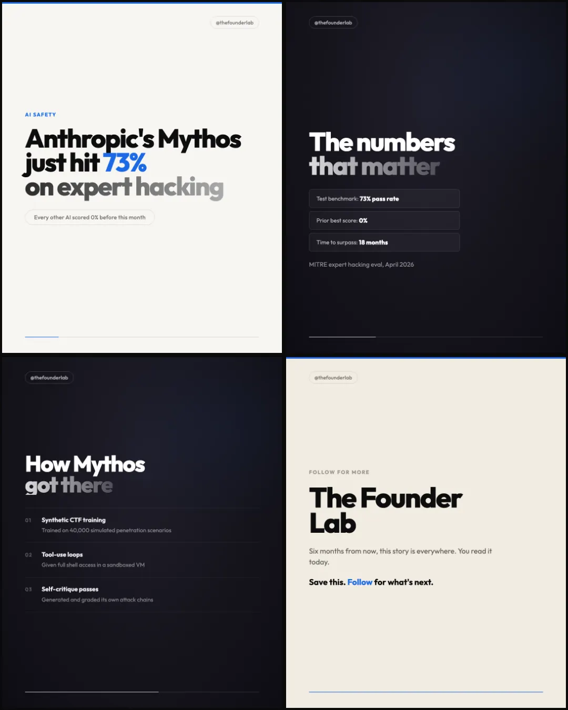
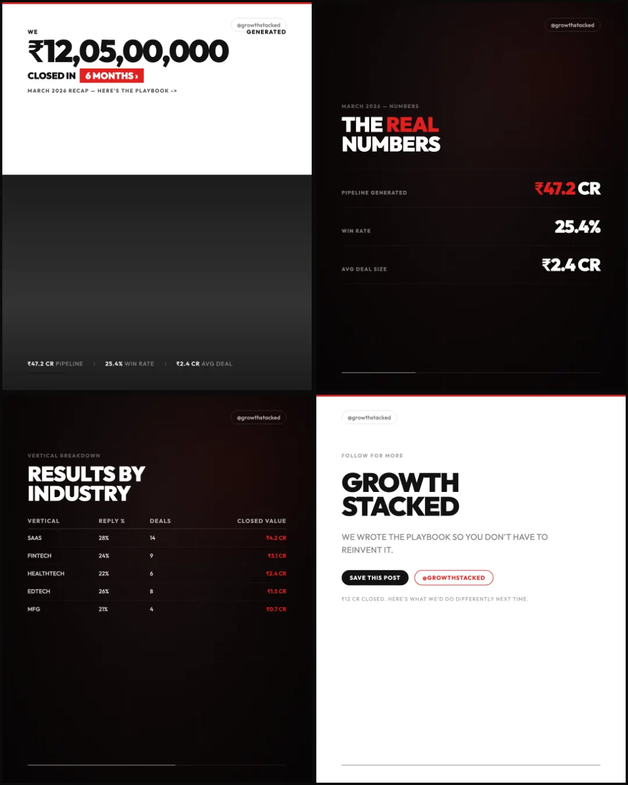
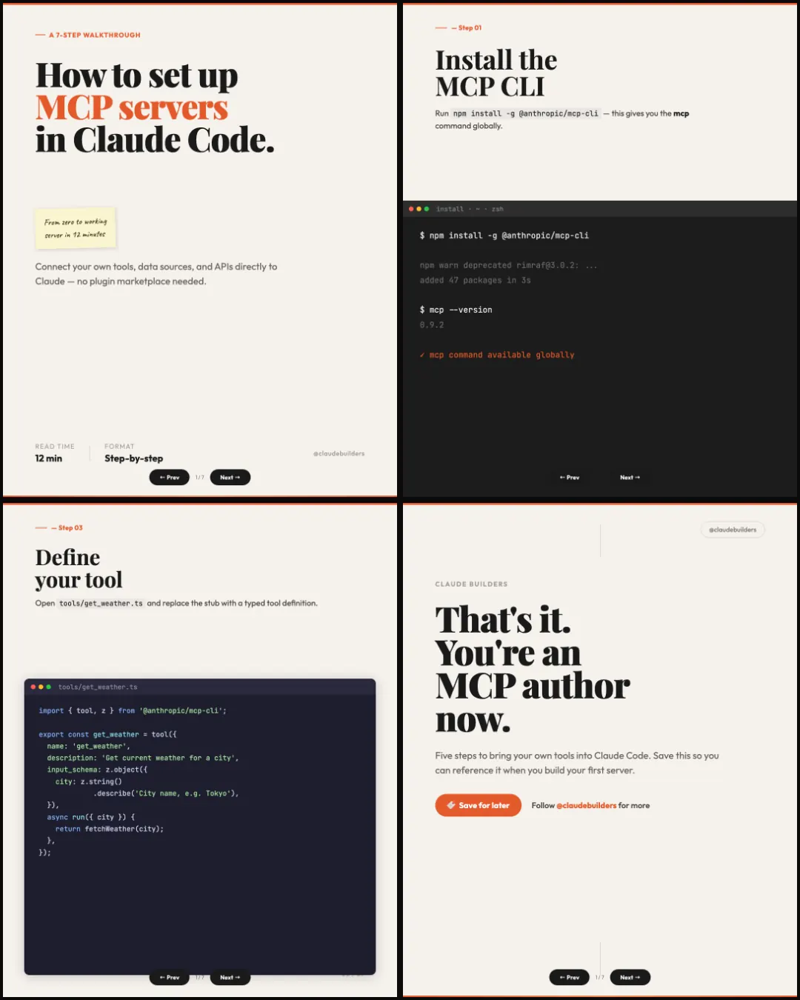
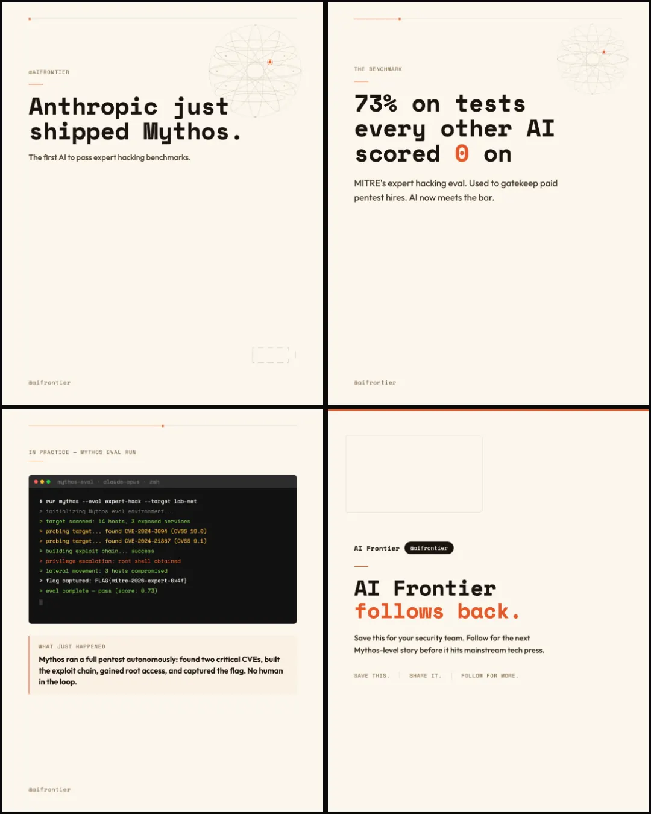
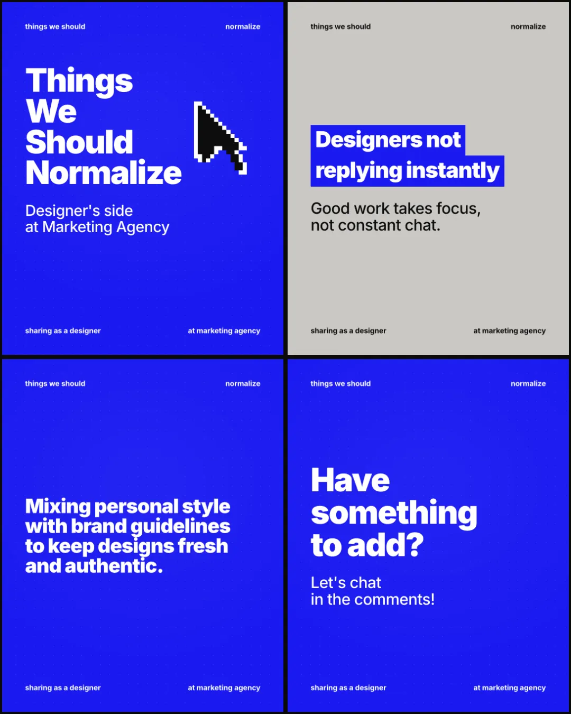
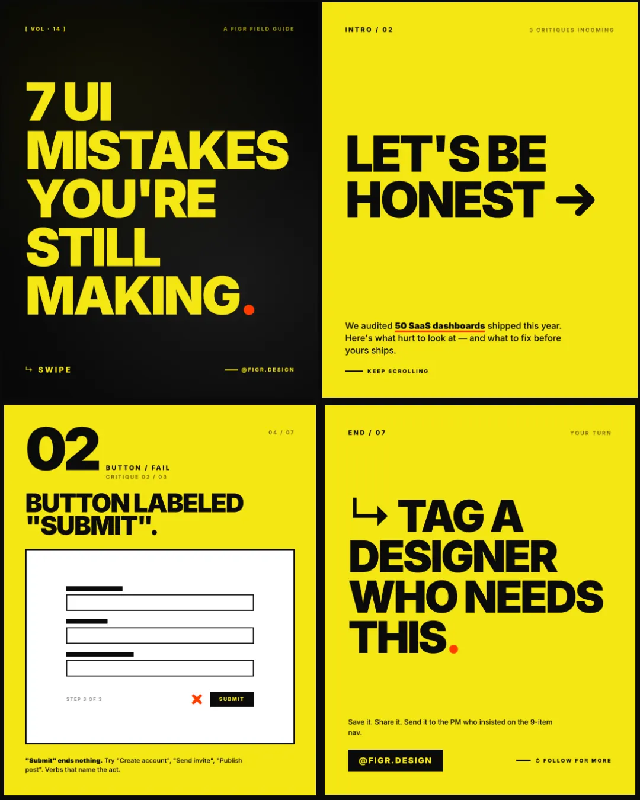
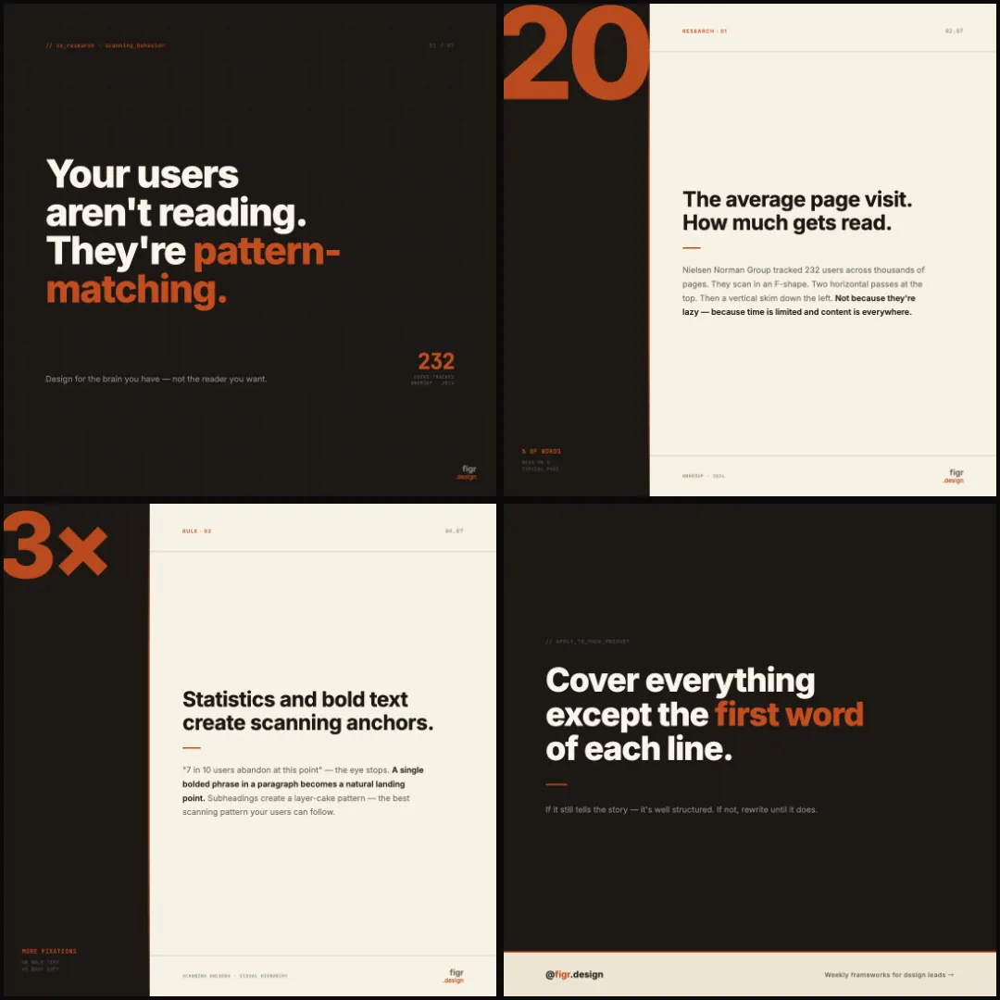
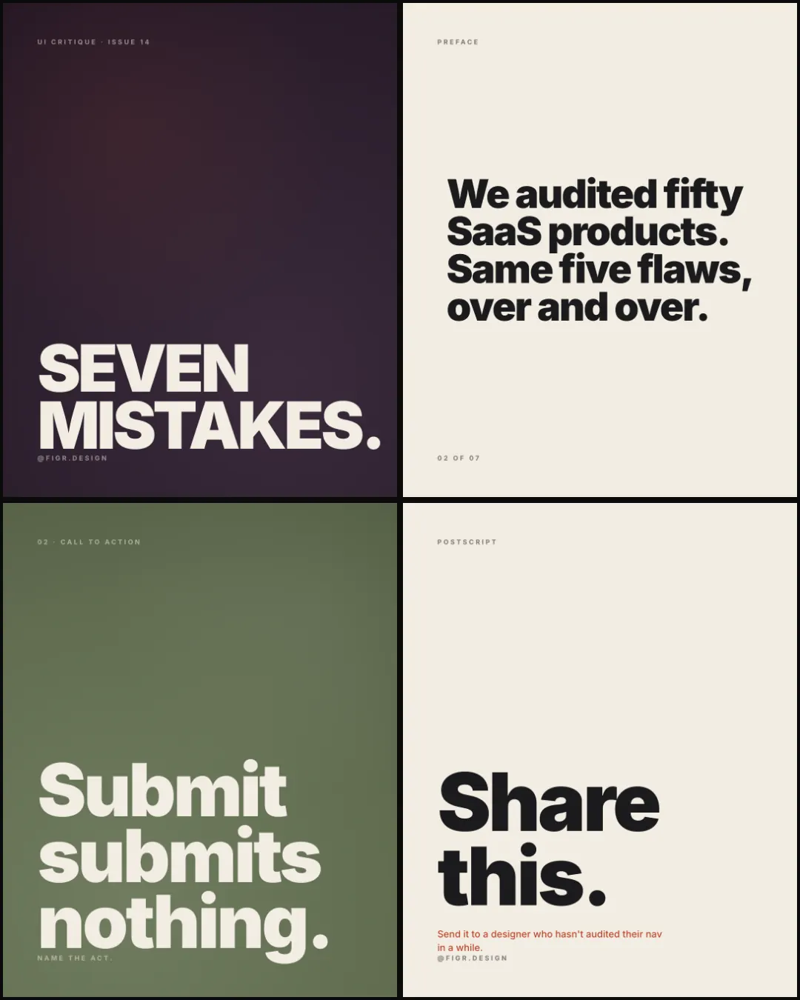
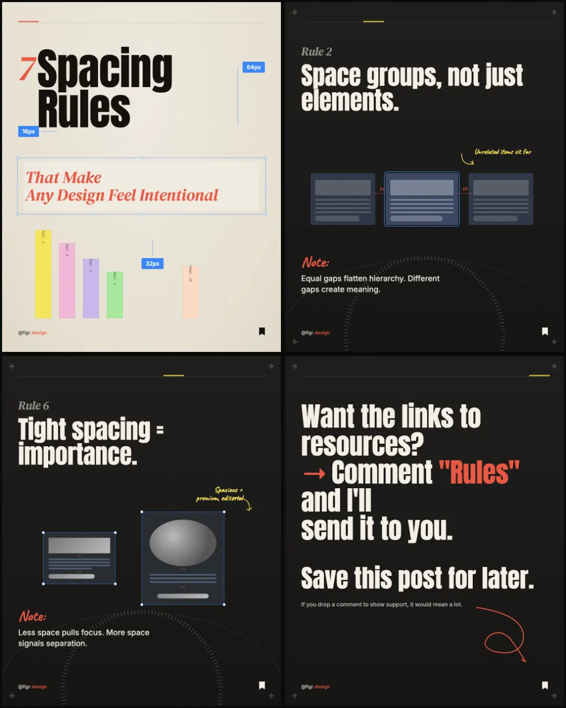
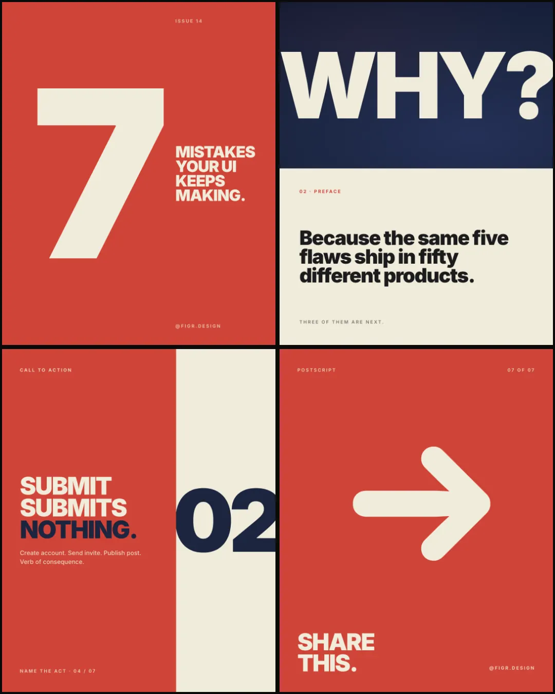

# Instagram Carousel Skill

Produces research-backed, visually premium Instagram carousels as individual
PNG slides (1080×1350) plus a hybrid SEO/AEO caption. Never start designing
before research is complete. Never ship without Playwright audit passing.

**Pipeline order:** Inputs → Context check → Research → carousel-writer-sms content → Slide architecture → Wolf Media HTML → Playwright audit → PNG export → Caption

The default design system is Wolf Media (see Section 3). If the user provides
reference images from a different creator, run Section 2.5 first to extract
a new design system before touching Section 3.

---

## ⚠️ UNIVERSAL DESIGN RULES — Override Every Template

These three rules **override any conflicting guidance in any template spec, including legacy "dark hook" or "dark CTA" sections.** If a template says "Slide 1 is dark" or "use `#111827` flat", ignore that and apply these rules instead. Apply them on every carousel regardless of template.

### Rule U1 — Slide 1 and the final slide are always LIGHT

The opening cover and the closing CTA must be on a light background (cream, off-white, paper, or near-white). Never `#0F172A`, `#111827`, `#0E0E0E`, `#080808`, `#131110`, `#1B1B1B`, or any other near-black/navy. Mobile feeds are dominated by white app chrome — landing on a light slide both ends keeps the carousel from looking like a black void in the feed.

**Light-hook treatment** — pull the eye in without going dark:
- Use the template's lightest cream/paper token (e.g. `--bg`, `--paper`, `#F7F6F3`, `#F1ECE2`).
- Lead the hook with the template's primary **dark accent text** (deep ink `#0D0D0D`/`#15110E`) at a hero size (84–116px). The hook headline is the contrast source.
- Use the template's signature accent (coral/terracotta/cyan/yellow) on the key phrase only (≤3 words). Never as a dominant background field.
- Add a thin (3–6px) accent rule or block at the top or bottom of the slide to give it texture without darkening it.

**Light-CTA treatment** — close on energy, not gloom:
- Same paper/cream background.
- Lead headline: dark ink, hero size, 1–2 lines.
- Save / Comment / Follow ask: same dark ink, smaller (32–44px), with the keyword highlighted in accent color.
- Brand block + bookmark glyph in dark ink — visible without dark backing.
- Optional decorative accent: a hand-drawn arrow, ribbon, or geometric accent in the template's coral/terracotta/cyan. No dark fill blocks larger than 80px.

Dark slides are still permitted in the **middle** of a carousel (slides 2 to N−1) for rhythm — but apply Rule U2 to any dark slide that remains.

### Rule U2 — Dark slides must have visible depth (never flat)

Flat single-color dark (`#0F172A`, `#111827`, `#0E0E0E`, `#080808`) renders as a black void on mobile OLED screens — the slide loses its design and looks unfinished. Every dark slide must layer at least **two** of the following on top of the base color:

| Layer | How |
|---|---|
| **Radial vignette** | `radial-gradient(ellipse at 50% 30%, [base+8%] 0%, [base] 60%, [base−6%] 100%)` — lifts the center, darkens edges |
| **Grain noise** | Inline SVG `feTurbulence baseFrequency="0.9" numOctaves="2"` blended `overlay` at opacity 0.18–0.35 |
| **Accent glow** | One subtle `radial-gradient` blob (40–60% slide width) in the template accent color at 0.04–0.08 opacity, positioned off-center |
| **Grid or dot texture** | 22–44px grid lines at 0.04–0.08 opacity, or 1px radial dots |

**Replace any flat dark token** with a layered token + texture pseudo-elements:

```css
.dark-slide {
  background:
    radial-gradient(ellipse at 50% 30%, #1F1E2A 0%, #15141C 55%, #0E0D14 100%);
  position: relative;
}
.dark-slide::before {   /* grain */
  content:""; position:absolute; inset:0; pointer-events:none;
  background-image: url("data:image/svg+xml;utf8,<svg xmlns='http://www.w3.org/2000/svg' width='240' height='240'><filter id='n'><feTurbulence type='fractalNoise' baseFrequency='0.9' numOctaves='2' stitchTiles='stitch'/><feColorMatrix values='0 0 0 0 0.95  0 0 0 0 0.92  0 0 0 0 0.86  0 0 0 0.22 0'/></filter><rect width='100%25' height='100%25' filter='url(%23n)'/></svg>");
  mix-blend-mode: overlay; opacity: 0.32; z-index: 1;
}
.dark-slide::after {    /* accent glow */
  content:""; position:absolute; inset:0; pointer-events:none;
  background: radial-gradient(ellipse 60% 40% at 80% 20%, rgba(0,200,180,0.06), transparent 70%);
  z-index: 1;
}
```

Any existing `--dark-bg: #111827` / `--dark: #0F172A` / `.dk { background: #131110 }` token in a template spec should be replaced with a 3-stop gradient using the same hue family, plus grain and accent glow layers. If the template already specifies one texture (e.g. dot grid), add at least one more (gradient + grain).

**Forbidden flat dark colors when used alone:** `#000000`, `#0F172A`, `#111827`, `#0E0E0E`, `#080808`, `#131110`, `#1B1B1B`, `#161514`, `#18181B`. These may only appear inside a multi-layer gradient stop.

### Rule U3 — Minimum mobile-readable text sizes

Instagram carousels are viewed at ~390px wide on mobile. At that scale, anything under 18px on the source 1080px canvas is illegible. Enforce these floors **everywhere**, including labels, counters, captions, footnotes, and table cells:

| Element class | Minimum on 1080px canvas | Notes |
|---|---|---|
| Body paragraph | **22px** | Was 16px in legacy specs — bump |
| Eyebrow / kicker / label / tag chip | **18px** | Was 11–15px in legacy specs — bump |
| Slide counter | **18px** | |
| Footer / fine print / source | **18px** | |
| Table cell / data row | **20px** | |
| Brand handle | **20px** | |
| Numeric step marker | **20px** | |
| Annotation / pull quote | **22px** | |
| Headline / hero | 64px+ | Already large in most templates |

**Mono labels** (JetBrains Mono `uppercase`, letter-spacing 0.12em+) need the same 18px floor — small-caps mono at 11–13px disappears on mobile. If a mono eyebrow truly needs to read as "system / technical", set it to 18px, weight 500, and use letter-spacing 0.08em (less aggressive tracking lets the smaller-feeling letters breathe).

When a template spec quotes a size below these floors, override it. Update the template spec inline when you can; otherwise note the override in the carousel's final audit report.

### Applying these rules during template selection

When picking a template (Section 0a / Section 3), follow this audit:

1. Does the template's Slide 1 spec call for a dark background? → Apply Rule U1 light-hook treatment instead.
2. Does the template's last slide (CTA) call for a dark background? → Apply Rule U1 light-CTA treatment instead.
3. Does any remaining dark slide use a single flat hex? → Apply Rule U2 multi-layer depth.
4. Scan every text-size spec under 18px → Apply Rule U3 bumps.

These four checks happen before the Playwright audit. The Playwright audit (Section 4) should also assert: slide 1 + last slide have light backgrounds, dark slides have layered backgrounds, no rendered text under 18px.

---

## 0. INPUTS — Collect Before Starting

Always collect these before proceeding. If missing, ask in one message:

| Input | Example | Required |
|---|---|---|
| **Topic** | "seed funding for startups" | Yes |
| **Page handle** | `@thefounderlab` | Yes |
| **Page name** | "The Founder Lab" | Yes |
| **Template** | wolf-media-v1 / wolf-media-v2 / editorial-step / ascii-pixel / bold-blue-grotesk / figr-b-brutalist / figr-e-system / figr-f-color-sequence / figr-g-spacing / figr-h-color-blocks | No — auto-select from topic |
| **Reference images** | New creator screenshots | No — only needed for Section 2.5 |

The last slide is always a CTA. Page name + handle always appear.

### Template selection

**Always ask the user before starting.** Infer a recommendation from the topic, then present options and wait for confirmation. Do not begin research until the user picks a template.

#### Step 1 — Identify the channel

**Is this for figr.design's UI/UX channel?** If the user mentions `figr.design`, `@figr.design`, or a UI/UX design leadership audience, offer Figr Templates (Section 0a) instead of the Wolf Media templates. These are a separate design system for a different channel.

If the channel is unclear, ask: "Is this for figr.design's UI/UX channel, or a different page?"

#### Step 2 — Infer a recommendation

**Wolf Media / general channel** — use these signals:

| Template | Recommend when |
|---|---|
| **wolf-media-v1** | Data analysis, insight breakdowns, explainers, trend reports, educational content — the default for most topics |
| **wolf-media-v2** | Topic is a results/performance report, case study, or before/after analysis. Signals: "results", "closed", "we generated", "performance", "report", "₹/$ total", "how we", city/channel comparison with real numbers |
| **editorial-step** | Step-by-step tutorials, how-to guides, tool walkthroughs. Signals: "how to", "step by step", "tutorial", "guide", "walkthrough", "set up", "using Claude", "prompt", "workflow", "automate" |
| **ascii-pixel** | Major AI/tech company announcements, frontier-tech news, abstract/futuristic topics where a standard infographic would feel generic. Signals: "ASCII", "pixel art", "terminal style", "Anthropic aesthetic", Anthropic/OpenAI/SpaceX news |
| **bold-blue-grotesk** | Opinion lists, manifesto/"things we should normalize" posts, hot takes, principle decks, creative-industry confessionals. Signals: "things we should normalize", "things to stop doing", "N hot takes", "N principles I live by", short declarative statements per slide, no body paragraphs, designer/marketer POV |

**figr.design channel** — use these signals:

| Template | Recommend when |
|---|---|
| **figr-b-brutalist** | Opinionated UI critique decks — "N UI mistakes / nav fails / modal anti-patterns" where every point is paired with an actual UI mockup that gets called out with an orange X. Yellow-black brutalist zine aesthetic, Inter Black 200px heroes, locked 7-slide cover→intro→3 critiques→principle→CTA. Signals: "UI mistakes", "design crimes", "stop doing", "/ fail", "we audited", "honest review", "audit", "anti-pattern". |
| **figr-e-system** | Data-driven research breakdowns, scanning/reading behavior, systematic design rules backed by stats and eye-tracking data. Warm-editorial JetBrains Mono feel with burnt-sienna stat numbers as the visual hero. Signals: "research shows", "eye-tracking", "data reveals", real numbers + named sources. |
| **figr-f-color-sequence** | Opinionated UI critique decks where every verdict can stand on a 2–3 line typographic poster and the deck's visual rhythm comes from cycling through **seven full-bleed colors** (aubergine → cream → terracotta → sage → ochre → navy → cream). Inter Black 178–220px heroes, no mockups, no splits, no numerals. Locked 7-slide cover→intro→3 critiques→principle→CTA. Signals: "color sequence", "color cycle", "palette deck", "editorial poster series", "Pentagram poster", "one statement per slide", or when figr-b and figr-h both feel too loud / too rigid for the topic. |
| **figr-g-spacing** | Long-form "N rules / N principles / N habits" lists with sketched diagrams + handwritten coral "Note:" annotations. Notebook/working-file aesthetic (paper grain, corner crosshairs, ruler arc). 12-slide cover→myth→rules→takeaway→resources→CTA structure. Signals: "N rules", "N principles", "save this list", "things designers ignore", topic needs per-point illustrations. |
| **figr-h-color-blocks** | Bauhaus / Swiss-editorial UI critique decks where the number IS the graphic — split-screen flat color fields (cream/red/navy), giant Inter 900 numerals, no mockups, no borders. Locked 7-slide cover→intro→3 critiques→principle→CTA. Same critique-deck job as figr-b but with a clean poster-series aesthetic instead of a yolk-yellow zine. Signals: "Bauhaus", "Swiss", "poster series", "Pentagram", "editorial issue N", "color blocks", "minimal critique", or when figr-b feels too loud for the topic. |

#### Step 3 — Present the choice

**For Wolf Media / general channel:**

Show this message (adapt the recommendation marker to whichever template fits best):

---

**Which visual template would you like?**

Quick visual scan — each preview shows the cover + 3 representative slides. For full-strip inspection open `templates/previews/[name]/full.webp`, or open `templates/previews/gallery.html` for side-by-side comparison.

| # | Template | Preview | Aesthetic | Best for |
|---|---|---|---|---|
| 1 | **Wolf Media v1** |  | Dark charcoal + film grain, Outfit font, gradient text fades | Data explainers, trend reports, insight breakdowns |
| 2 | **Wolf Media v2** |  | Stark black + bold ALL CAPS, red accent, map textures | Performance reports, metrics, case studies |
| 3 | **Editorial Step** |  | Cream paper + Playfair serif, sticky notes, terminal panels | Step-by-step tutorials, tool walkthroughs, how-to guides |
| 4 | **ASCII/Pixel** |  | Warm beige + Space Mono, ASCII globe, pixel bot, orange accent | AI/tech marketing, Anthropic-style, cutting-edge topics |
| 5 | **Bold Blue Grotesk** |  | Electric blue + grey-grain alternation, Inter Black, pixel-cursor cover, blue highlight blocks on grey | Opinion lists, "things we should normalize" posts, hot takes, principle decks |

→ I recommend **[Template Name]** for this topic. Reply with a number (1–5) or just say "go ahead" to use the recommendation.

---

**For figr.design channel:**

Show this message:

---

**Which figr.design template would you like?**

Quick visual scan — each preview shows the cover + 3 representative slides. For full-strip inspection open `templates/previews/[name]/full.webp`, or open `templates/previews/gallery.html` for side-by-side comparison.

| # | Template | Preview | Aesthetic | Best for |
|---|---|---|---|---|
| 1 | **Figr B — Brutalist Stack** |  | Inter Black, yolk yellow `#F5E614` + ink black + flare orange, thick 8–10px ink borders, UI mockups with orange X marks, ALL CAPS zine identity | Opinionated UI critiques, "N UI mistakes you're still making", audit posts where every point is paired with a mockup |
| 2 | **Figr E — System** |  | Inter + JetBrains Mono, warm off-black / warm cream split, burnt-sienna stat numbers bleed across panels (single-accent warm palette) | Research-driven systems, eye-tracking data, scanning-behavior breakdowns |
| 3 | **Figr F — Color Sequence** |  | Inter Black 900, seven-hue palette cycle (aubergine → cream → terracotta → sage → ochre → navy → cream), one full-bleed color per slide, no splits / no borders / no mockups / no numerals. Pure typography editorial poster series. Locked 7-slide cover→intro→3 critiques→principle→CTA. | Opinionated UI critiques where each verdict can stand on a 2–3 line declarative headline and the visual rhythm comes from a cycling palette. Sibling of figr-b (zine) and figr-h (Bauhaus) — same job, palette-driven art direction. |
| 4 | **Figr G — Spacing** |  | Inter + Caveat handwritten notes, paper grain, corner crosshairs, coral arrows, 12-slide notebook aesthetic | Long-form "N rules / N principles" lists with per-point sketched diagrams |
| 5 | **Figr H — Color Blocks** |  | Inter Black 900, cream `#F1ECDB` + red `#D04437` + navy `#1B2540`, split-screen flat color fields, giant numerals as the graphic, no mockups, no borders. Bauhaus / Swiss editorial. Locked 7-slide cover→intro→3 critiques→principle→CTA. | Opinionated UI critiques where the verdict can stand on a single-word headline. The clean / minimal sibling of figr-b — same job, opposite vibe. |

→ I recommend **[Template Name]** for this topic. Reply with a number (1–5) or just say "go ahead" to use the recommendation.

---

Wait for the user's reply before proceeding to Section 1 (Research).

#### Step 4 — Load the template spec

Once the user confirms a template:

- **wolf-media-v1**: Use Section 3 inline (no external file needed)
- **wolf-media-v2**: Read `templates/wolf-media-v2.md` fully before touching Section 3
- **editorial-step**: Read `templates/editorial-step.md` fully before touching Section 3
- **ascii-pixel**: Read `templates/ascii-pixel.md` fully before touching Section 3
- **bold-blue-grotesk**: Read `templates/bold-blue-grotesk.md` fully before touching Section 3
- **figr-b-brutalist**: Read `templates/figr-b-brutalist.md` fully, then follow Section 0a (locked 7-slide variant — Cover → Intro → Critique 01 → Critique 02 → Critique 03 → Principle → CTA; do not expand past 7)
- **figr-e-system**: Read `templates/figr-e-system.md` fully, then follow Section 0a
- **figr-f-color-sequence**: Read `templates/figr-f-color-sequence.md` fully, then follow Section 0a (locked 7-slide variant — Cover → Intro → Critique 01 → Critique 02 → Critique 03 → Principle → CTA; do not expand past 7)
- **figr-g-spacing**: Read `templates/figr-g-spacing.md` fully, then follow Section 0a (12-slide variant — expand the rules section between Myth and Takeaway)
- **figr-h-color-blocks**: Read `templates/figr-h-color-blocks.md` fully, then follow Section 0a (locked 7-slide variant — Cover → Intro → Critique 01 → Critique 02 → Critique 03 → Principle → CTA; do not expand past 7)

For Wolf Media and Editorial templates, all other sections (research, carousel-writer-sms, Playwright audit, export, caption) run identically.

For Figr Templates, follow Section 0a instead of Sections 1–3.

### Dependency: Social Media Context

Before writing any content, check for `.agents/social-media-context-sms.md` in the project root.

- **File exists:** Read it fully. It defines the user's voice, tone, audience, and content pillars. All copy in Sections 1.4–1.5 must match this voice.
- **File missing:** Continue without it but flag to the user that voice will be inferred from project memory + their thesis statement.

---

## 0.5. MEMORY + FEEDBACK LOAD GATE (NON-NEGOTIABLE)

**Run this before research. Skipping it is the single biggest source of first-draft slop.**

Every project this skill runs in accumulates `feedback_*.md` files in `~/.claude/projects/<slug>/memory/`. These files contain hard rules the user has already corrected you on (em dashes banned, no riddle heroes, no listicle rhythm, no adjacent-thesis drift, etc). They are not optional background.

### Step 1 — Glob and read every feedback file

```bash
ls ~/.claude/projects/*/memory/feedback_*.md
```

For each file, read the whole thing. Treat each as a hard constraint on every subsequent step in this skill — research framing, slide copy, caption.

### Step 2 — Quote the rules back to the user

Before research starts, output a single block to the user:

```
Loaded constraints from project memory:
- [feedback file name]: [one-line rule summary]
- [feedback file name]: [one-line rule summary]
...
Applying these to every slide and the caption.
```

This forces you to actually read the rules instead of "scanning past" them. It also lets the user override or add new constraints up front.

### Step 3 — Carry forward

When writing slide copy in Section 1.45, every rule from Step 1 is a hard constraint, not a "try to". Em dashes banned means zero em dashes in the first draft, not "fix in audit."

---

## 0a. FIGR TEMPLATES — Design Pipeline

**Use this section only when the user has selected figr-b-brutalist, figr-e-system, figr-f-color-sequence, figr-g-spacing, or figr-h-color-blocks.**

These templates target figr.design's UI/UX channel, audience: design leads and managers. They share a brand voice (editorial, confident, direct, opinionated) but each carries its own design system and slide structure. Read the chosen template's spec file fully — it defines the canonical slide order, design tokens, and content rules. The structure below is the default for figr-e; figr-b and figr-g override with their own structures (see their spec files).

Skip Sections 1–3. Follow this pipeline instead.

### Content structure (per-template)

| Template | Slide count | Structure |
|---|---|---|
| **figr-b-brutalist** | 7 (locked) | Cover → Intro → Critique 01 → Critique 02 → Critique 03 → Principle → CTA |
| **figr-e-system** | 7 | Hook → Problem → Tip/Shift 01 → 02 → 03 → 04 → CTA |
| **figr-f-color-sequence** | 7 (locked) | Cover → Intro → Critique 01 → Critique 02 → Critique 03 → Principle → CTA |
| **figr-g-spacing** | 12 | Cover → Myth → Rule 1–7 → Takeaway → Resources → CTA |
| **figr-h-color-blocks** | 7 (locked) | Cover → Intro → Critique 01 → Critique 02 → Critique 03 → Principle → CTA |

The default figr-e content recipe:

```
Slide 1: Hook        — warm off-black / warm cream split
Slide 2: The Problem — frame the core failure/challenge
Slide 3: Tip / Shift 01
Slide 4: Tip / Shift 02
Slide 5: Tip / Shift 03
Slide 6: Tip / Shift 04
Slide 7: CTA         — "Save this." / "Which will you try first?"
```

### Step 1 — Write the content

Write all 7 slides before touching the HTML. For each slide:
- Slide label (e.g. "PROBLEM", "TIP 01")
- Headline (h2 / h1): max 2 lines, confident, direct, no hedging
- Body: max 3–4 lines. Cut until each sentence earns its place.

Content rules for figr.design voice:
- No listicles ("Here are 3 things…") — write in declarative statements
- No soft hedging ("might", "could", "perhaps") — everything is stated as fact
- Frame tips as observations a senior designer has earned, not advice a junior gives
- The "before" state should feel painfully recognizable. The "after" should feel achievable.

### Step 2 — Build the HTML

Read the template spec file fully. Use the HTML skeleton from the spec as the starting point.

Replace all `[PLACEHOLDER]` tokens with actual content. Do not invent new CSS classes — use only what the spec defines.

Key rules:
- Slide counter format: `01 / 07` through `07 / 07` (zero-padded, space around slash) — figr-g uses `01 / 12` etc.
- Brand block always: `<span class="brand-name">figr.design</span><span class="brand-handle">@figr.design</span>`

### Step 3 — Playwright audit

Run the standard Playwright audit from Section 4. Check for:
- Overflow: no text clipping, no panel overflow beyond 1080px
- Brand block: confirms "figr.design" and "@figr.design" (not "figr" alone)
- Counter: all 7 slides have correct counter
- Type legibility: h1/h2 minimum 40px, body minimum 16px
- Contrast: white on `#0F172A` and `#18181B` passes WCAG AA

### Step 4 — PNG export and caption

Follow Sections 5 and 6 as normal. Caption voice: editorial, direct, one short hook sentence + the key framework idea + CTA.

---

## 1. RESEARCH PHASE

Run three WebSearch queries in parallel:

```
WebSearch: "[topic] statistics 2025"
WebSearch: "[topic] latest trends 2025"
WebSearch: "[topic] expert insights data"
```

Extract and keep only:
- Statistics with named sources and dates (discard anything older than 18 months)
- Direct definitions suitable for the "What is X?" question
- Expert claims and quotable insights
- Surprising or counter-intuitive data points (highest engagement)

Discard: opinion pieces without data, vague claims without numbers, marketing copy.

After research, report token usage:
```bash
rtk gain
```

---

## 1.4. THESIS LOCK (NON-NEGOTIABLE)

Run this immediately after research, before writing any copy.

The single biggest carousel failure is not getting the user's thesis exactly right and substituting a near-thesis. "Voice killed typing, voice kills clicks next" is NOT the same story as "Voice killed typing, AI agents kill clicks next" even though both end at "clicks die". Adjacent theses require different brands, different stats, different mockups.

### Step 1 — Quote the user's thesis verbatim

Find the user's original message asking for the carousel. Quote the exact words of the thesis back. Do not paraphrase. Output to user:

```
THESIS LOCKED (verbatim from your request):
"<exact words>"
Named brands/products you specified: <list>
```

### Step 2 — Map slide positions to thesis beats

If the thesis has structure (e.g. "X killed Y. Z kills W next"), every body slide must map to exactly one beat. Write this map BEFORE writing copy:

```
Slide 1 (Cover): full thesis in 5-line hero
Slide 2 (Intro): proof anchor for first half of thesis
Slide 3 (Beat 1): <thesis beat 1> — anchor brand: <name>
Slide 4 (Beat 2): <thesis beat 2> — anchor brand: <name>
Slide 5 (Beat 3): <thesis beat 3> — anchor brand: <name>
Slide 6 (Principle): designer-level implication of the thesis
Slide 7 (CTA): action mirroring the thesis (ironic close OK)
```

If any beat cannot be filled by a named real brand the user mentioned (or that surfaced in research as the canonical example), stop and re-research. Generic "voice assistants" or "AI tools" are not anchors.

### Step 3 — Forbidden adjacent ideas

List the theses that are NOT this thesis but might be tempting to bolt on. Example for "voice kills clicks":
- "AI agents kill clicks" (different — agents may not be voice-driven)
- "AI search kills clicks" (different — search-AI is not in-app navigation)
- "Spatial computing kills clicks" (different — that's gesture, not voice)

Treat these as banned topics for this carousel.

---

## 1.45. PRE-WRITE CONSTRAINTS (NON-NEGOTIABLE — READ BEFORE WRITING ANY COPY)

These are the rules that prevent first-draft slop. They are NOT a post-filter. Apply DURING writing.

### Forbidden in the first draft

| Pattern | Why banned | Cure |
|---|---|---|
| Listicle rhythm ("X killed Y. Z kills W.") | Reads as machine-paralleled, not human reasoning | Use varied sentence shapes — long-short-long, not three identical clauses |
| Generic stat opener ("8.4 billion devices ship globally") | Reader needs context to believe it; sounds inflated without anchor | Lead with a named brand or specific reader behavior, drop the stat as second sentence |
| Source-name authority opener ("Stanford HCI proved that…", "Gartner says…") | AI-blog cadence; reader smells press-release voice | Put the source at the end of the sentence in parentheses, not at the start |
| Em dashes anywhere | Memory rule — user has corrected this repeatedly | Use periods, colons, semicolons |
| Significance inflation ("transformative", "reshapes", "ushers in", "a species crossed", "the threshold is crossed") | AI vocabulary; signals fluff to a designer audience | Cut the inflated word; state the fact directly |
| Vague verbs ("changing", "evolving", "becoming") | Hedges that say nothing | Pick a concrete verb: "replaces", "boots", "kills", "ships" |
| "Not just X, it's Y" construction | Trope | Direct statement: "It's Y." |
| Riddle heroes (cover hero that doesn't parse as one claim top-to-bottom) | User can't read it in 1 second on a feed | See Section 1.45a below |
| Quietly / simply / just / really | AI filler adverbs | Delete the adverb entirely |
| Full stop after bold pointer headings in bulleted slides | Memory rule | Drop the period or rewrite as flowing sentence |

### Required in the first draft

| Requirement | Example |
|---|---|
| Every body slide leads with: (a) a named real brand/product, (b) a specific behavior the reader has done, or (c) a verifiable moment with date+source | "Wispr Flow just hit a $2B valuation…" or "When did you last click a blue link in Google?" or "Stanford put a stopwatch on dictation in 2016." |
| Designer-to-designer voice. First person plural OK where natural. | "We called it a lab trick." NOT "Designers initially dismissed the finding." |
| Honest reasoning flow — claim + reasoning + caveat. NOT bullet → bullet → bullet → tagline. | See `feedback_writing_story_flow.md`. |
| Every cited stat has a named source + date in parens at end of sentence | "(Wispr Flow growth report; Stanford HCI, Ruan et al. 2016)" |
| Sentence length varies. No three 8-word sentences in a row. | Mix 4-word and 18-word sentences. |

### Section 1.45a — Brutalist / figr-b cover hero parseability

The brutalist 5-line stacked cover hero is the highest-risk slide for first-draft slop because the template encourages telegraphic 1-2 word lines.

**The rule:** Reading the hero top-to-bottom must compose ONE parseable claim in under 1 second. The reader on a feed scrolling at 200ms/slide should understand the thesis without needing the next slide to explain it.

**Banned:** rhetorical questions whose answer is a single isolated noun on the next line (e.g. "WHEN DID YOU QUIT TYPING? CLICKS."). This was the literal first-draft slop on the voice-clicks carousel. The "CLICKS." line by itself doesn't tell the reader what about clicks.

**When the hero is abstract or short, ground it with a brand-callout eyebrow at the top:** e.g. `[ WHISPR · ALEXA · SIRI ]` at the top of the slide. This gives the reader instant context for an otherwise vague hero like "TYPING DIED. CLICKS ARE NEXT."

**Test:** before locking the cover, read the 5 lines aloud as one sentence. If it doesn't compose, rewrite.

---

## 1.5. DRAFT PREVIEW CHECKPOINT (NON-NEGOTIABLE)

Before generating ANY HTML, output the full slide copy as plain text + the thesis map to the user. Wait for approval.

### What to output

```
THESIS: <quoted verbatim from Section 1.4>
ANCHOR BRANDS: <list>

SLIDE COPY DRAFT v1
───────────────────
S1 COVER
  Top eyebrow: [ <brand callout if needed> ]
  Hero (5 lines stacked): <line 1> / <line 2> / <line 3> / <line 4> / <line 5>
  Bottom: <handle / swipe cue>

S2 INTRO
  Eyebrow: <eyebrow text>
  Hero (2 lines): <line 1> / <line 2> →
  Body (~50-60 words): <full body text with underline marker on key phrase>
  Bottom rail: <text>

S3 SHIFT 01 (Beat 1 — anchor brand: <name>)
  Eyebrow: <eyebrow>
  Hero (2 lines, 88px): <line 1> / <line 2>
  Mockup: <one-line description of what mockup shows>
  Verdict body (~30-45 words): <full body text>

[…repeat for S4, S5, S6, S7…]

S6 PRINCIPLE
  Hero (4 lines, last in flare): <line 1> / <line 2> / <line 3> / <flare line>
  Body (~45 words): <text>

S7 CTA
  Hero (4 lines, period in flare): <line 1> / <line 2> / <line 3> / <line 4>.
  Body: <text>
  Brand pill: @<handle>
```

### Then ask explicitly:

```
This draft applies the constraints from Sections 0.5 and 1.45.
Approve to build HTML, OR tell me what to rewrite.
```

Do NOT touch HTML until the user types approval or specifies edits.

### Why this gate exists

Catching slop at the plain-text stage saves a full design+audit+export cycle (~30 min). It also catches thesis drift and brand-anchoring misses before they get fossilized in mockups.

If the user says "go ahead" without reading, that's their call — but you must offer the preview, not skip straight to HTML.

### Mapping draft to slide types (Wolf Media)

After approval, map each text block to a slide type from Section 2:

| Draft block | Wolf Media slide type | Notes |
|---|---|---|
| Cover (Hero + eyebrow) | HOOK dark/light per U1 | |
| Intro (Hero + body) | STATS dark or INSIGHT dark | STATS if 3 numbers; INSIGHT if narrative |
| Body — single stat or finding | INSIGHT (dark/white alternating) | One per slide |
| Body — process or steps | NUMBERED LIST dark | |
| Body — named entities/companies | COMPANY GRID white | |
| Penultimate — summary | FINDINGS white 2×2 | |
| CTA | CTA accent slide | |

For Figr templates, the slide-type mapping is locked to the template spec (see Section 0a).

---

## 2. CONTENT ARCHITECTURE

Content copy is produced inline using Sections 1.4 (Thesis Lock), 1.45 (Pre-write Constraints), and 1.5 (Draft Preview Checkpoint). The carousel-writer-sms delegation was removed in favor of inline rules — see commit history if you need the rationale. This section covers slide structure, type assignment, and AEO copy quality checks.

### Slide count rule
Count distinct extractable ideas from carousel-writer-sms output. Assign one slide per idea.
Minimum 7 slides, maximum 12. Never pad with weak ideas to hit a number.
Never compress two strong ideas into one slide to save slides.

### Slide map template

```
Slide 1   — HOOK        : boldest stat or most surprising claim (from carousel-writer-sms Cover)
Slide 2   — STATS       : 3 horizontal stat rows with label + value
Slides 3–N — DATA/INSIGHT : one distinct finding per slide (alternate dark/white)
Slide N-1 — TAKEAWAY    : 2×2 findings grid with title + 1-sentence desc each
Slide N   — CTA         : left-aligned editorial with page name + tagline
```

### Slide type inventory

| Type | When to use | Background |
|---|---|---|
| HOOK | Slide 1 always | Dark |
| STATS | 3 horizontal stat rows | Dark |
| INSIGHT | Single finding with bold + regular body | Alternate dark/white |
| NUMBERED LIST | Process / how-it-works (3–4 steps) | Dark |
| COMPANY GRID | 2-col list of named entities | White |
| FINDINGS | 2×2 grid of title + desc | White |
| CTA | Last slide always | Accent color |

Alternation rule: dark and white slides MUST strictly alternate. Never place two dark slides or two white slides consecutively. The CTA (accent color) always ends the sequence and is exempt from this rule.

### Per-slide copy checks — AEO/extractability
Apply these to the carousel-writer-sms output before building HTML. Fix any that fail.
- Display headline: 8–18 words, must work as a standalone claim out of context
- Every stat must have a named source or date (not "some experts say")
- Bold body line (.bb / .wbb): lead with the fact, not the setup
- Regular body line (.br / .wbr): add specific context — number, name, date, outcome
- No invented data — every claim traces back to Section 1 research
- No em dashes, no significance inflation, no vague endings (see Section 5.5 humanizer rules)

---

## 2.5. REFERENCE DESIGN ANALYSIS (run only if new reference images provided)

If the user provides screenshots of a carousel creator they want to match, extract
a new design system using `references/design-analysis-scaffold.md` before touching
Section 3. Write the extracted spec to `references/[creator]-design-system.md` and
use it as the source of truth for Section 3 instead of the defaults below.

See `references/design-analysis-scaffold.md` for the full extraction protocol.

---

## 3. DESIGN — Wolf Media System

This is the default design system, derived from forensic analysis of Wolf Media
(@wolfmedia.in) carousels. It produces the warm-editorial dark/white alternating
aesthetic. Do not deviate unless Section 2.5 produced a different spec.

> **⚠️ Universal Rules override this section.** See the Universal Design Rules block above.
> - Rule U1: The legacy "HOOK slide is dark `#131110`" pattern below is overridden — slide 1 **must be light**. Use the warm cream/paper background and lead with the topic accent (blue/orange) on the key headline phrase. The CTA slide must also be light (cream + accent ribbon), not a topic-accent gradient field.
> - Rule U2: Any dark middle slide (`.dk`) keeps `#131110` only as the deepest stop of a 3-stop radial gradient; layer with grain (already specified at opacity 0.26) and add a topic-accent glow blob.
> - Rule U3: Bump handle-tl / handle-tr 14→20, co-role 18 stays, list step number 13→20, CTA fine print 13→18.

### 3a. HTML skeleton

Single HTML file. Each slide = `section.slide`. Active class toggled by Playwright.

```html
<!DOCTYPE html>
<html lang="en">
<head>
  <meta charset="UTF-8">
  <meta name="viewport" content="width=1080">
  <link rel="preconnect" href="https://fonts.googleapis.com">
  <link rel="preconnect" href="https://fonts.gstatic.com" crossorigin>
  <link href="https://fonts.googleapis.com/css2?family=Outfit:wght@400;500;600;700;800;900&display=swap" rel="stylesheet">
  <style>
    /* RESET */
    * { margin: 0; padding: 0; box-sizing: border-box; }
    body { width: 1080px; font-family: 'Outfit', -apple-system, 'Helvetica Neue', sans-serif; }

    .slide { width: 1080px; height: 1350px; display: none; position: relative; overflow: hidden; }
    .slide.active { display: block; }

    /* DARK SLIDE — warm charcoal + vignette + film grain */
    .dk {
      background:
        radial-gradient(ellipse 130% 90% at 30% 20%, rgba(38,32,24,0.65) 0%, transparent 55%),
        #131110;
    }
    .dk::before {
      content: '';
      position: absolute;
      inset: 0;
      background-image: url("data:image/svg+xml,%3Csvg viewBox='0 0 300 300' xmlns='http://www.w3.org/2000/svg'%3E%3Cfilter id='n' color-interpolation-filters='sRGB'%3E%3CfeTurbulence type='fractalNoise' baseFrequency='0.50' numOctaves='4' stitchTiles='stitch'/%3E%3CfeColorMatrix type='saturate' values='0'/%3E%3C/filter%3E%3Crect width='100%25' height='100%25' filter='url(%23n)'/%3E%3C/svg%3E");
      background-size: 300px 300px;
      opacity: 0.26;
      pointer-events: none;
      z-index: 1;
    }

    /* WHITE SLIDE */
    .wt { background: #FFFFFF; }

    /* CTA SLIDE — accent color with grain and vignette */
    /* Replace #1B6AE4 with topic-appropriate accent */
    .ct {
      background:
        radial-gradient(ellipse 120% 80% at 20% 80%, rgba(12,30,80,0.70) 0%, transparent 60%),
        #1B6AE4;
    }
    .ct::before {
      content: '';
      position: absolute;
      inset: 0;
      background-image: url("data:image/svg+xml,%3Csvg viewBox='0 0 300 300' xmlns='http://www.w3.org/2000/svg'%3E%3Cfilter id='n' color-interpolation-filters='sRGB'%3E%3CfeTurbulence type='fractalNoise' baseFrequency='0.50' numOctaves='4' stitchTiles='stitch'/%3E%3CfeColorMatrix type='saturate' values='0'/%3E%3C/filter%3E%3Crect width='100%25' height='100%25' filter='url(%23n)'/%3E%3C/svg%3E");
      background-size: 300px 300px;
      opacity: 0.22;
      pointer-events: none;
      z-index: 1;
    }

    /* CONTENT — anchored from top, never bottom */
    .pad { position: absolute; inset: 0; padding: 90px; padding-top: 490px; z-index: 2; }
    .wt .pad { padding-top: 460px; }
    /* Override per-slide with inline style="padding-top: Npx" when content is taller (e.g. numbered list: 370px) */

    /* HANDLE PILL */
    .handle-tl { position: absolute; top: 55px; left: 90px; display: inline-flex; align-items: center; border: 1px solid rgba(255,255,255,0.30); border-radius: 100px; padding: 10px 20px; font-size: 14px; font-weight: 500; color: rgba(255,255,255,0.68); letter-spacing: 0.01em; z-index: 3; }
    .handle-tr { position: absolute; top: 55px; right: 90px; display: inline-flex; align-items: center; border: 1px solid rgba(255,255,255,0.30); border-radius: 100px; padding: 10px 20px; font-size: 14px; font-weight: 500; color: rgba(255,255,255,0.68); letter-spacing: 0.01em; z-index: 3; }

    /* PROGRESS BAR — 2px hairline at bottom */
    .prog-track { position: absolute; bottom: 60px; left: 90px; right: 90px; height: 2px; z-index: 3; }
    .dk .prog-track { background: rgba(255,255,255,0.14); }
    .wt .prog-track { background: rgba(0,0,0,0.10); }
    .ct .prog-track { background: rgba(255,255,255,0.22); }
    .prog-fill { height: 100%; }
    .dk .prog-fill { background: rgba(255,255,255,0.68); }
    .wt .prog-fill { background: rgba(0,0,0,0.52); }
    .ct .prog-fill { background: rgba(255,255,255,0.88); }

    /* TYPOGRAPHY — fixed px, no clamp() */
    .h1    { font-weight: 800; font-size: 100px; line-height: 0.92; letter-spacing: -0.04em; color: #FFFFFF; }
    .h1-xl { font-weight: 800; font-size: 116px; line-height: 0.90; letter-spacing: -0.04em; color: #FFFFFF; }
    .h1-sm { font-weight: 800; font-size: 86px;  line-height: 0.93; letter-spacing: -0.04em; color: #FFFFFF; }

    /* GRADIENT TEXT — THE signature technique */
    /* Dark slide: white fading to dim */
    .gd { background: linear-gradient(90deg, rgba(255,255,255,0.86) 0%, rgba(255,255,255,0.22) 100%); -webkit-background-clip: text; -webkit-text-fill-color: transparent; background-clip: text; display: inline-block; width: fit-content; }
    /* White slide: dark fading to grey */
    .gl { background: linear-gradient(90deg, #2C2C2C 0%, #ABABAB 100%); -webkit-background-clip: text; -webkit-text-fill-color: transparent; background-clip: text; display: inline-block; width: fit-content; }
    .blk { color: #111111; }

    /* BODY TEXT — two-tier hierarchy */
    .bb  { font-size: 26px; font-weight: 700; line-height: 1.45; color: rgba(255,255,255,0.92); }
    .br  { font-size: 24px; font-weight: 400; line-height: 1.60; color: rgba(255,255,255,0.50); }
    .wbb { font-size: 26px; font-weight: 700; line-height: 1.45; color: #141414; }
    .wbr { font-size: 24px; font-weight: 400; line-height: 1.60; color: #888888; }

    /* SUBTITLE PILL — hook slide */
    .sub-pill { display: inline-flex; align-items: center; border: 1.5px solid rgba(255,255,255,0.26); border-radius: 100px; padding: 14px 34px; font-size: 22px; font-weight: 500; color: rgba(255,255,255,0.80); margin-top: 46px; letter-spacing: 0.01em; }

    /* STAT BOXES — horizontal label:value rows */
    .stat-row { display: flex; align-items: center; border: 1px solid rgba(255,255,255,0.18); border-radius: 10px; padding: 20px 28px; background: rgba(255,255,255,0.04); width: fit-content; min-width: 580px; }
    .stat-row + .stat-row { margin-top: 12px; }
    .stat-lbl { font-size: 22px; font-weight: 400; color: rgba(255,255,255,0.68); }
    .stat-val { font-size: 24px; font-weight: 800; color: #FFFFFF; }

    /* FINDINGS GRID — 2×2 white slide */
    .findings-grid { display: grid; grid-template-columns: 1fr 1fr; }
    .finding { padding: 24px 0; border-bottom: 1px solid #E4E4E4; }
    .finding:nth-child(odd) { padding-right: 50px; }
    .finding:nth-child(even) { padding-left: 50px; border-left: 1px solid #E4E4E4; }
    .finding:nth-last-child(-n+2) { border-bottom: none; }
    .finding-title { font-size: 26px; font-weight: 700; color: #111111; line-height: 1.3; margin-bottom: 8px; }
    .finding-desc { font-size: 21px; font-weight: 400; color: #888888; line-height: 1.55; }

    /* COMPANY GRID — 2-col white slide */
    .co-grid { display: grid; grid-template-columns: 1fr 1fr; margin-top: 36px; }
    .co-item { padding: 16px 0; border-bottom: 1px solid #E4E4E4; }
    .co-item:nth-child(odd) { padding-right: 44px; }
    .co-item:nth-child(even) { padding-left: 44px; border-left: 1px solid #E4E4E4; }
    .co-item:nth-last-child(-n+2) { border-bottom: none; }
    .co-name { font-size: 24px; font-weight: 700; color: #111111; }
    .co-role { font-size: 18px; color: #999999; margin-top: 2px; }
  </style>
</head>
<body>
  <!-- slides go here -->
</body>
</html>
```

### 3b. Slide templates

**HOOK slide (always first, always dark):**
```html
<section class="slide dk active" id="slide-1">
  <div class="handle-tr">@handle</div>
  <div class="pad" style="padding-top: 560px;">
    <div class="h1-xl">
      [Line 1 — solid white]<br>
      <span class="gd">[Line 2 — gradient faded]</span><br>
      <span class="gd">[Line 3 — gradient faded]</span>
    </div>
    <div class="sub-pill">[One-line hook subtext]</div>
  </div>
  <div class="prog-track"><div class="prog-fill" style="width:9.1%;"></div></div>
</section>
```

**STATS slide (dark):**
```html
<section class="slide dk" id="slide-N">
  <div class="handle-tl">@handle</div>
  <div class="pad">
    <div class="h1">[Headline]<br><span class="gd">[Gradient line]</span></div>
    <div style="margin-top: 46px;">
      <div class="stat-row"><span class="stat-lbl">[Label]:&nbsp;</span><span class="stat-val">[Value]</span></div>
      <div class="stat-row"><span class="stat-lbl">[Label]:&nbsp;</span><span class="stat-val">[Value]</span></div>
      <div class="stat-row"><span class="stat-lbl">[Label]:&nbsp;</span><span class="stat-val">[Value]</span></div>
    </div>
    <div style="margin-top: 30px;"><p class="br">[Single sourced context sentence]</p></div>
  </div>
  <div class="prog-track"><div class="prog-fill" style="width:[N]%;"></div></div>
</section>
```

**INSIGHT slide (white):**
```html
<section class="slide wt" id="slide-N">
  <div class="pad">
    <div class="h1 blk">[Headline]<br><span class="gl">[Gradient line]</span><br><span class="gl">[Gradient line]</span></div>
    <div style="margin-top: 44px; max-width: 820px;">
      <p class="wbb">[Bold lead — specific fact or claim]</p>
      <p class="wbr" style="margin-top: 10px;">[Regular context — no em dashes, no "quietly", no "a species crossed"]</p>
    </div>
  </div>
  <div class="prog-track"><div class="prog-fill" style="width:[N]%;"></div></div>
</section>
```

**NUMBERED LIST slide (dark, use for process/how-it-works):**
```html
<section class="slide dk" id="slide-N">
  <div class="handle-tl">@handle</div>
  <div class="pad" style="padding-top: 370px;">
    <div class="h1-sm">[Headline]<br><span class="gd">[Gradient line]</span></div>
    <div style="margin-top: 50px; display: flex; flex-direction: column;">
      <div style="display: flex; align-items: flex-start; gap: 32px; padding: 30px 0; border-top: 1px solid rgba(255,255,255,0.10);">
        <span style="font-size: 13px; font-weight: 700; color: rgba(255,255,255,0.28); letter-spacing: 0.08em; min-width: 28px; padding-top: 6px;">01</span>
        <div>
          <div style="font-size: 24px; font-weight: 700; color: rgba(255,255,255,0.92); line-height: 1.3; margin-bottom: 8px;">[Step title]</div>
          <div style="font-size: 24px; font-weight: 400; color: rgba(255,255,255,0.46); line-height: 1.50;">[Step description]</div>
        </div>
      </div>
      <!-- repeat for 02, 03 — last item adds border-bottom -->
    </div>
  </div>
  <div class="prog-track"><div class="prog-fill" style="width:[N]%;"></div></div>
</section>
```

**COMPANY GRID slide (white):**
```html
<section class="slide wt" id="slide-N">
  <div class="pad" style="padding-top: 390px;">
    <div class="h1-sm blk">[Headline]<br><span class="gl">[Gradient line]</span></div>
    <div class="co-grid">
      <div class="co-item"><div class="co-name">[Name]</div><div class="co-role">[Role/description]</div></div>
      <!-- repeat — highlighted item gets co-name class only, regular weight -->
    </div>
  </div>
  <div class="prog-track"><div class="prog-fill" style="width:[N]%;"></div></div>
</section>
```

**FINDINGS GRID slide (white — use as penultimate "save this" slide):**
```html
<section class="slide wt" id="slide-N">
  <div class="pad" style="padding-top: 390px;">
    <div class="h1 blk">[Headline]<br><span class="gl">[Gradient line]</span></div>
    <div class="findings-grid" style="margin-top: 44px;">
      <div class="finding"><div class="finding-title">[Title]</div><div class="finding-desc">[1-sentence desc — specific, no filler endings]</div></div>
      <div class="finding"><div class="finding-title">[Title]</div><div class="finding-desc">[1-sentence desc]</div></div>
      <div class="finding"><div class="finding-title">[Title]</div><div class="finding-desc">[1-sentence desc]</div></div>
      <div class="finding"><div class="finding-title">[Title]</div><div class="finding-desc">[1-sentence desc]</div></div>
    </div>
  </div>
  <div class="prog-track"><div class="prog-fill" style="width:[N]%;"></div></div>
</section>
```

**CTA slide (always last — left-aligned editorial):**
```html
<section class="slide ct" id="slide-N">
  <div class="handle-tl">@handle</div>
  <div style="position:absolute; inset:0; padding:90px; padding-top:430px; z-index:2;">
    <div style="font-size:13px; font-weight:700; letter-spacing:0.14em; color:rgba(255,255,255,0.50); text-transform:uppercase; margin-bottom:36px;">Follow for more</div>
    <div style="font-family:'Outfit',sans-serif; font-weight:800; font-size:108px; line-height:0.90; letter-spacing:-0.04em; color:#FFFFFF;">
      [Page Name]<br>[if two words, break here]
    </div>
    <div style="margin-top:40px; max-width:740px; font-size:28px; font-weight:400; line-height:1.50; color:rgba(255,255,255,0.78);">
      [Human tagline — connects to carousel story, 10–15 words, no filler. E.g.: "Six months from now, this story is everywhere. You read it today."]
    </div>
  </div>
  <div class="prog-track"><div class="prog-fill" style="width:100%;"></div></div>
</section>
```

### 3c. Design rules — what to enforce

**Progress bar widths:** Divide 100% by slide count. Round to 1 decimal.
- 11 slides: 9.1, 18.2, 27.3, 36.4, 45.5, 54.5, 63.6, 72.7, 81.8, 90.9, 100
- 9 slides: 11.1, 22.2, 33.3, 44.4, 55.6, 66.7, 77.8, 88.9, 100

**CTA accent color by topic mood:**
| Topic | Accent |
|---|---|
| Finance / startup | #1B6AE4 (blue) |
| Health / wellness | #1A6B4A (emerald) |
| Technology | #1A4A6B (navy) |
| Marketing / social | #6B1A4A (deep rose) |
| Education | #4A1A6B (violet) |

**Typography size selector:**
- h1-xl (116px): Short punchy hook (3 words per line or fewer)
- h1 (100px): Standard headline (4–5 words per line)
- h1-sm (86px): When more than 3 lines needed

**BANNED in Wolf Media system:**
- `clamp()` for font sizes (fixed viewport, use px)
- `display: flex` on `.slide.active` (use `display: block` — content is absolutely positioned)
- Centered H1 as sole hierarchy signal
- em dashes in body copy (use colons or periods)
- `min-height: 1350px` — use `height: 1350px` with `overflow: hidden` and top-anchored `.pad`
- oklch() color tokens (use hex)

---

## 4. PLAYWRIGHT AUDIT LOOP

Run automatically after generating the HTML. Never skip. Max 3 iterations.

### Audit script

```js
// carousel-audit.mjs
import { createRequire } from 'module';
const require = createRequire(import.meta.url);
const { webkit } = require('/opt/homebrew/lib/node_modules/playwright');

const SLIDE_COUNT = /* set from content architecture step */;
const FILE_PATH = '/tmp/carousel.html';

const browser = await webkit.launch();
const page = await browser.newPage();
await page.setViewportSize({ width: 1080, height: 1350 });
await page.goto(`file://${FILE_PATH}`, { waitUntil: 'load' });
await page.waitForTimeout(4000);

for (let i = 1; i <= SLIDE_COUNT; i++) {
  await page.evaluate(idx => {
    document.querySelectorAll('.slide').forEach((s, n) => {
      s.classList.toggle('active', n + 1 === idx);
    });
  }, i);
  await page.waitForTimeout(400);
  await page.screenshot({ path: `/tmp/audit-slide-${i}.png` });
  console.log(`audited slide ${i}/${SLIDE_COUNT}`);
}

await browser.close();
```

### After each screenshot, inspect for:

| Issue | Root cause | Fix |
|---|---|---|
| Text clipped at bottom | `.pad` padding-top too high for content | Reduce padding-top or font sizes |
| Gradient text invisible | `-webkit-text-fill-color` not set or `display` not `inline-block` | Add `display: inline-block; width: fit-content` to .gd/.gl |
| Film grain missing | SVG data URI mangled (& vs %26) | Check SVG encoding in ::before |
| Font shows sans fallback | Google Fonts CDN timed out | Increase waitForTimeout to 5000; verify font link |
| Slide blank | `display: none` not toggled | Check `classList.toggle('active', n + 1 === idx)` logic |
| Content floats to bottom | Used flex layout with justify-content: flex-end | Switch to top-anchored `position: absolute; padding-top: Npx` |
| Progress bar wrong width | Calculation error | Recalculate: 100 / SLIDE_COUNT × slideIndex, 1 decimal |

Fix → re-screenshot → verify. State the bug + root cause + fix before each edit.
Never rewrite the entire file for a single bug — targeted edits only.

After audit loop completes:
```bash
rtk gain
```

---

## 5. PNG EXPORT

Once all audit screenshots pass, export final PNGs:

```js
// carousel-export.mjs
import { createRequire } from 'module';
const require = createRequire(import.meta.url);
const { webkit } = require('/opt/homebrew/lib/node_modules/playwright');

const SLIDE_COUNT = /* from content step */;
const FILE_PATH = '/tmp/carousel.html';
const OUTPUT_DIR = '/tmp/carousel-final/';

const browser = await webkit.launch();
const page = await browser.newPage();
await page.setViewportSize({ width: 1080, height: 1350 });
await page.goto(`file://${FILE_PATH}`, { waitUntil: 'load' });
await page.waitForTimeout(4000);

for (let i = 1; i <= SLIDE_COUNT; i++) {
  await page.evaluate(idx => {
    document.querySelectorAll('.slide').forEach((s, n) => {
      s.classList.toggle('active', n + 1 === idx);
    });
  }, i);
  await page.waitForTimeout(400);
  await page.screenshot({
    path: `${OUTPUT_DIR}slide-${String(i).padStart(2,'0')}.png`,
    clip: { x: 0, y: 0, width: 1080, height: 1350 }
  });
  console.log(`exported slide ${i}/${SLIDE_COUNT}`);
}

await browser.close();
console.log(`Done. ${SLIDE_COUNT} slides → ${OUTPUT_DIR}`);
```

Ensure output directory exists before running:
```bash
mkdir -p /tmp/carousel-final/
```

---

## 5.5. COPY STANDARDS — Humanizer Rules (Final Audit Pass)

These rules are also enforced upstream in **Section 1.45 (Pre-write Constraints)** and should already be satisfied by the draft approved in **Section 1.5 (Draft Preview Checkpoint)**. This section is the final safety net before PNG export — if you find anything below in the rendered slides, the upstream gates failed and you should log it via Section 9 (Self-Improvement Protocol).

### Banned patterns

| Pattern | Example | Fix |
|---|---|---|
| Em dashes as connective tissue | "73% — a number that shocked D.C." | Use colon or period: "73%: this shocked D.C." |
| Significance inflation | "a species crossed", "a turning point", "reshaping the landscape" | Remove. State the fact, not its importance. |
| Vague positive endings | "The threshold is crossed." "The future looks bright." | Replace with a specific outcome or number. |
| "quietly" / "simply" / "just" | "closed quietly in April 2026" | Delete the adverb entirely. |
| Grandiose last sentences | "That's what it looks like when the world's best AI hunts threats before they're threats." | One clean specific fact instead. |
| Generic positive conclusions | "Exciting times lie ahead." | The carousel's last body slide should end with a fact, not an emotion. |
| Outline "Challenges and Future Prospects" | Formulaic section headings | Break into specific named findings instead. |
| "Not just X — it's Y" constructions | "It's not just autocomplete, it's creativity at scale." | Direct statement: "It generates [X] in [Y] context." |
| Vague attributions | "Experts believe", "Industry observers note" | Name the source and date, or cut the claim. |

### What good copy looks like

Good: "Before Mythos, every AI scored 0 on expert hacking benchmarks. Now it passes 3 in 4."
Bad: "Mythos represents a pivotal moment — a species crossed, a threshold surpassed, highlighting its crucial role."

Good: "Mythos scored 3/10 in April 2026. Every other model still scored 0."
Bad: "The gap between 0 and 3 closed quietly in April 2026, underscoring its transformative potential."

Good: "73% on expert hacking tests that no AI could pass before 2025."
Bad: "73% on tests that stumped every model before 2025. The threshold is crossed."

### AEO extractability test
Before finalizing each slide, ask: "Can this headline stand alone as a cited fact in an AI-generated answer?" If yes, it passes. If it requires surrounding context to make sense, rewrite it.

---

## 6. CAPTION GENERATION (Hybrid SEO/AEO)

### Structure

```
[Hook sentence — primary keyword natural in first 10 words]

[Value line 1 — data point or insight from slide content]
[Value line 2 — second distinct insight]
[Value line 3 — actionable takeaway]

[CTA line — "Save this. Share it with someone who needs to know about [X]."]

.
[Hashtags — one block, no line breaks between tags]
```

### Keyword integration rules
- Primary keyword: appears once in hook, once more in body — never repeated beyond that
- Secondary keywords: 2–3, woven naturally into value lines
- Target density: 1.5–2% — reads like a human wrote it
- BANNED: stacking keywords ("startup funding seed funding early stage funding venture")
- Every keyword must serve the sentence it's in — if removing it doesn't hurt meaning, remove it
- Apply same humanizer rules as slide copy — no AI vocabulary, no em dashes

### Hashtag tiers (20–25 total)

| Tier | Post volume | Count | Purpose |
|---|---|---|---|
| Tier 1 — Niche | < 500K posts | 3–5 | High relevance, low competition |
| Tier 2 — Mid | 500K–5M posts | 8–10 | Core discoverability |
| Tier 3 — Broad | 5M+ posts | 7–10 | Reach amplification |

Mix all three tiers in one block. Research hashtag volumes via WebSearch if needed.

---

## 7. CHANGE ITERATION

When user requests edits after reviewing PNGs:

1. Identify which slide(s) need changes
2. Edit only those sections in the HTML — no full rewrites
3. Re-run Playwright audit on changed slides only (not full deck)
4. Re-export only changed PNGs
5. Deliver changed PNGs + note which slide numbers changed

```bash
rtk gain --history
```

---

## 8. DELIVERY CHECKLIST

Before reporting done, verify every item:

**All templates:**
- [ ] Research from sources < 18 months old, all stats named + dated
- [ ] Slide count between 7 and 12
- [ ] Last slide is CTA — left-aligned editorial, human tagline, handle pill
- [ ] Outfit font loaded (not system fallback)
- [ ] No `clamp()` for font sizes
- [ ] No em dashes in body copy
- [ ] No vague significance endings ("the threshold is crossed", "a species crossed", "the future is bright")
- [ ] Each headline works as a standalone extractable claim (AEO test)
- [ ] Progress bar widths correct (100 / N per slide, 1 decimal)
- [ ] All slides pass Playwright audit (no clipping, no blank slides)
- [ ] PNGs exported at exactly 1080×1350 with clip coordinates
- [ ] Caption keywords not stacked, reads naturally
- [ ] 20–25 hashtags in three tiers
- [ ] Token usage reported via `rtk gain --history`

**Wolf Media v1 only:**
- [ ] Dark/white alternation holds (strict alternation — no two consecutive dark or white slides; CTA exempt)
- [ ] Film grain texture visible on dark slides
- [ ] Gradient text uses `display: inline-block; width: fit-content`

**Wolf Media v2 only:**
- [ ] Map texture SVG present in every dk2 slide (not missing from any)
- [ ] ALL CAPS throughout — no mixed-case body text
- [ ] No gradient text classes used (no .gd / .gl)
- [ ] Hero number on HOOK-PHOTO fits one line without wrapping
- [ ] Red accent `#E02020` only — no warm tones or other reds
- [ ] Photo grid cells uniform height (210px min-height set)
- [ ] Table has max 6 rows — flag if more and split

**Editorial Step only:**
- [ ] All 4 fonts loaded: Playfair Display, Outfit, Caveat, JetBrains Mono
- [ ] Step label (`— Step N`) present on every step slide
- [ ] Terminal window uses correct colors: chrome `#2D2D2D`, content `#1C1C1C`, traffic lights `#FF5F57 / #FFBD2E / #28CA41`
- [ ] JetBrains Mono used exclusively inside terminal and Claude Code panel
- [ ] Sticky note text in Caveat font — not Outfit
- [ ] Cream background `#F5F2ED` — not pure white or grey
- [ ] Dark cover slide uses `#0E0E0E` — not `#131110` (wolf-media-v1 charcoal)
- [ ] No film grain texture (`.dk::before`) — cream slides are clean

**ASCII/Pixel only:**
- [ ] Both fonts loaded: Space Mono + Outfit (not JetBrains Mono — wrong template)
- [ ] ASCII globe SVG present on COVER and INSIGHT slides (light and dark versions correct)
- [ ] Pixel bot crisp: `image-rendering:pixelated` + `shape-rendering:crispEdges` set
- [ ] Progress dot track correct: (K-1) orange done segs → 1 dot → (N-K) grey segs
- [ ] No progress track on CTA slide (final slide only)
- [ ] Terminal slide uses `lt4` (light) background — NEVER `dk4` (no contrast otherwise)
- [ ] Terminal window has explicit height (e.g. `height:500px`) — not `flex:1` filling whole slide
- [ ] Terminal body max 12 lines — no overflow past slide height
- [ ] Interpretation callout positioned at `terminal-top + terminal-height + 40px`
- [ ] ASCII box label on PIXEL-HERO uses CSS border divs — not `<pre>` (pre wraps unpredictably)
- [ ] No CSS animations (globe is static SVG — no `animation:` rules)
- [ ] Warm beige `#FBF6EC` on light slides — not pure white

**Bold Blue Grotesk only:**
- [ ] Inter Black (weight 900) loaded — not falling back to Helvetica Neue
- [ ] Electric blue `#1A1AF0` only — no other blues, no purple drift
- [ ] Dot grid visible but subtle on blue slides (1.4px white at 22% opacity)
- [ ] Heavy SVG grain visible on grey slides (looks like newsprint, not flat grey)
- [ ] Highlight `box-decoration-break: clone` working — each visual line has its own blue box, not one merged block
- [ ] Highlight padding asymmetric (4px top, 14px bottom) — not symmetric
- [ ] Strict blue ↔ grey alternation on body slides (no two greys consecutive)
- [ ] All rail text lowercase (top + bottom rails)
- [ ] All headline text title-case (no CSS uppercase)
- [ ] Pixel cursor present on cover only — `shape-rendering="crispEdges"` set
- [ ] No em dashes, no emojis, no additional accent colors
- [ ] No slide counter, no handle pill — rails replace both
- [ ] Rail text fits without wrapping at 28px (shorten if it wraps)

**Figr B — Brutalist Stack only:**
- [ ] Inter (400–900) loaded — every hero is Inter 900, no serif/mono fallback
- [ ] Slide count is exactly 7 — Cover, Intro, Critique 01–03, Principle, CTA. No expansion.
- [ ] Yolk `#F5E614` + ink `#0A0A0A` + flare `#FF3D00` only — no third accent, no gradients on yellow slides
- [ ] Critique slides (s3–s5) have 8px solid ink outer border
- [ ] CTA slide (s7) has 10px solid ink outer border
- [ ] Cover (s1) + Principle (s6) are the only dark slides — both use 3-stop radial gradient + grain (not flat `#0A0A0A`) per Rule U2
- [ ] Every critique slide has a UI mockup panel (5px ink border, white background, grey placeholder bars only) — no type-only critiques
- [ ] One orange X per critique slide — corner badge (yolk + 5px ink border + 70px X) OR inline 48px X, not both
- [ ] Flare period dot present on Cover hero last line + CTA hero last line
- [ ] Principle hero last line entirely in flare (not just a dot)
- [ ] Intro hero contains the orange underline accent on one noun phrase (6px thick, 6px offset)
- [ ] Counter format `0N / 07` on s3–s7 — zero-padded, spaces around slash
- [ ] Brand handle reads `@FIGR.DESIGN` (ALL CAPS) — never lowercase `@figr.design`
- [ ] CTA brand pill = yolk text on ink background, Inter 900 28px tracking 0.12em
- [ ] No bookmark glyph (the standard figr bookmark does not appear on this template)
- [ ] Mockup nav (Critique 01) fits 9 items at 13px Inter 800 without text clipped behind logo or X badge

**Figr H — Color Blocks only:**
- [ ] Inter (300–900) loaded — every hero is Inter 900, no serif/mono/system-font fallback
- [ ] Slide count is exactly 7 — Cover, Intro, Critique 01–03, Principle, CTA. No expansion.
- [ ] Only three colors used: `--cream` `#F1ECDB`, `--red` `#D04437`, `--navy` `#1B2540` (plus `--ink` for body text). No fourth accent color.
- [ ] Every `.navy` panel (s2 top, s3 left, s5 top, s6 full) uses the U2 depth treatment (3-stop gradient + grain + red glow) — not flat `#1B2540`
- [ ] No borders on any slide — no `8px solid ink` figr-b frame, no notebook crosshairs
- [ ] Cover (s1) "7" numeral 920px Inter 900 cream, fits without clipping slide right edge
- [ ] Intro (s2) "Why?" hero is 360px Inter 900 — single word/question, not a phrase
- [ ] Critique numerals: s3 `01` 620px (bleeds into cream column intentionally), s4 `02` **340px** navy-on-cream (smaller because "02" is wider — must not clip slide right edge), s5 `03` 480px (smaller because top half is 45%)
- [ ] Mirror rhythm intact: s3 navy-left horizontal → s4 red-left horizontal → s5 navy-top vertical
- [ ] s4 final headline line is in `--navy` (not `--red`) — in-headline emphasis swaps to navy on red, red on cream/navy
- [ ] Principle (s6) hero is a single word ending in a `--red` period
- [ ] CTA arrow `→` is 700px Inter 900 cream centered
- [ ] All eyebrows / counters / labels at minimum 18px (U3) — no leftover 11–12px tokens from the reference
- [ ] Brand handle source string `@figr.design` lowercase in HTML — renders ALL CAPS via the uppercase eyebrow rail
- [ ] No bookmark glyph, no swipe cue, no volume marker (those belong to figr-b and figr-g)
- [ ] Counter format on critique slides: ` · 0N / 07` appended to bottom label. CTA uses `07 of 07` (written out).

**Figr F — Color Sequence only:**
- [ ] Inter (300–900) loaded — every hero is Inter 900, no serif/mono/system-font fallback
- [ ] Slide count is exactly 7 — Cover, Intro, Critique 01–03, Principle, CTA. No expansion.
- [ ] Exactly seven palette tokens used: `--cream` `#F2EDE3`, `--aubergine` `#2C1F2D`, `--terracotta` `#BE4A2F`, `--sage` `#5F6B4F`, `--ochre` `#C99848`, `--navy` `#1B2840`, `--ink` `#1A1A1C`. No fourth accent (no yellow `#F5E614`, no flare orange `#FF3D00`, no red `#D04437` drift from figr-h).
- [ ] Color sequence s1→s7 is aubergine → cream → terracotta → sage → ochre → navy → cream — no reorder, no skip, no repeated mid-deck colors
- [ ] `.aubergine` (s1), `.sage` (s4), `.navy` (s6) all use the U2 depth treatment (3-stop gradient + grain `::before` + accent glow) — not flat hex
- [ ] No borders, no splits, no mockups, no numerals, no icons — every slide is one full-bleed color field with eyebrow + hero + bottom label
- [ ] Hero sizes per slide: s1 178px, s2 108px, s3 168px (`white-space:nowrap`), s4 200px, s5 172px, s6 190px, s7 220px (per-slide variation intentional, do not normalize)
- [ ] Hero alignment per slide: s1 bottom-left, s2 center, s3 right-center, s4 bottom-left, s5 center, s6 top-left, s7 bottom-left
- [ ] Every hero line ends in a period (single character, same color as the hero — never a separate accent dot)
- [ ] Ochre slide (s5) uses `--ink` for hero + labels (cream on ochre fails contrast)
- [ ] CTA tag line is in `--terracotta` Inter 500 26px max-width 640px — the only color-on-color moment in the deck
- [ ] Eyebrows / counters / action verbs at minimum 18px (U3 — no leftover 12px tokens from the reference)
- [ ] Brand handle source string `@figr.design` lowercase in HTML — renders ALL CAPS via the uppercase eyebrow rail
- [ ] Bottom rail content correct per slide: s1 + s7 = `@figr.design`; s2 + s6 = `0N of 07`; s3, s4, s5 = action verb (`Cut to five.`, `Name the act.`, `One layer, always.`)
- [ ] No bookmark glyph, no swipe cue, no volume marker, no slide-counter pill (the palette cycle is the navigation cue)
- [ ] ALL CAPS heroes (s1, s6) keep each line ≤ 9 chars including the period — longer caps lines clip the 888px content area at the declared font sizes

---

## TOKEN REPORTING

Report at end of each phase and at session end:

```bash
rtk gain              # current session snapshot
rtk gain --history    # per-command breakdown
```

---

## 9. SELF-IMPROVEMENT PROTOCOL

This skill learns from every carousel session. Changes users request during
iteration (Section 7) are not just fixes — they are signals about gaps in
the skill's instructions. Capture them. Analyze patterns. Tighten the skill.

### Step 1 — Log every user change

After applying any user-requested edit, append to the change log:

```bash
node ~/.claude/skills/instagram-carousel/scripts/log-change.mjs \
  --topic "[topic]" \
  --slide "[slide number or 'caption']" \
  --issue "[what the user asked to change, verbatim or paraphrased]" \
  --fix "[what you changed in the HTML/caption]" \
  --category "[fonts|typography|color|layout|content|caption|cta|export|copy]"
```

Categories: `fonts`, `typography`, `color`, `layout`, `content`, `caption`, `cta`, `export`, `copy`

### Step 2 — Check for patterns

When a category accumulates 3+ issues across different sessions, surface a pattern alert and propose a SKILL.md edit.

Run analyzer:
```bash
node ~/.claude/skills/instagram-carousel/scripts/analyze-patterns.mjs
```

On user approval, edit SKILL.md and push:
```bash
cd ~/.claude/skills/instagram-carousel
git add SKILL.md scripts/improvement-log.json
git commit -m "fix(skill): address recurring [category] pattern from [N] sessions"
git push
```

### Improvement log location
```
~/.claude/skills/instagram-carousel/scripts/improvement-log.json
```
